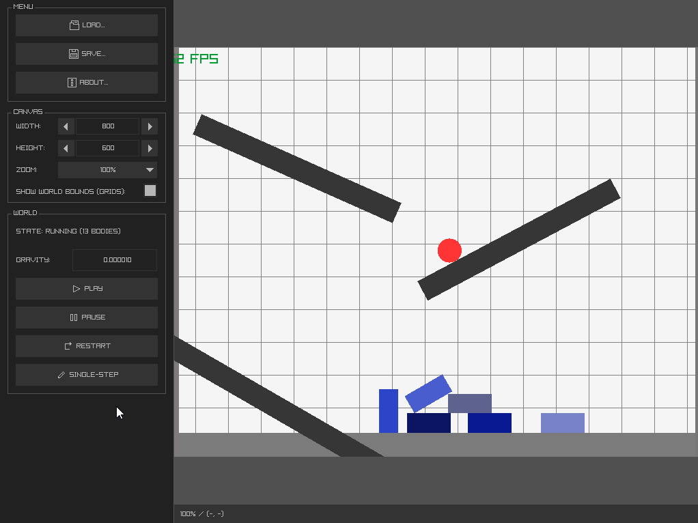
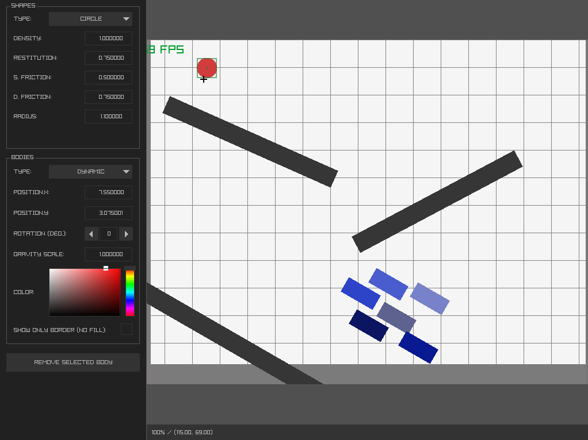

<div align="center">

<br>

[](https://github.com/c-krit/rbedit/releases)
[](https://github.com/c-krit/rbedit)
[](https://github.com/c-krit/rbedit/blob/main/LICENSE)

A lightweight physics simulation environment for the [ferox physics library](https://github.com/c-krit/ferox).

**WARNING: This software is in an early alpha stage, use it at your own risk.**

</div>

## Features

|   01   |   02   |
| ------ | ------ |
|  |  |

- Canvas with custom width and height, as well as camera zoom
- Press the left `Ctrl` key while scrolling with your mouse to quickly zoom in and out
- Drag dynamic rigid bodies with your mouse, or use arrow keys to change their positions
- Play, pause, restart, or single-step the physics simulation whenever you want
- Add, remove, or change the properties of the rigid bodies on the panel

## Prerequisites

- GCC version 9.4.0+
- GNU Make version 4.1+
- Git version 2.17.1+

```console
$ sudo apt install build-essential git
```

## Building

This project uses [GNU Make](https://www.gnu.org/software/make) as the build system.

1. Clone this repository

```console
$ git clone https://github.com/c-krit/rbedit && cd rbedit
```

2. Build [raylib](https://github.com/raysan5/raylib) and [ferox](https://github.com/c-krit/ferox) in `rbedit/lib` directory

3. Build this project with `make`, `make PLATFORM=WINDOWS`, or `make PLATFORM=WEB`

## License

MIT License
