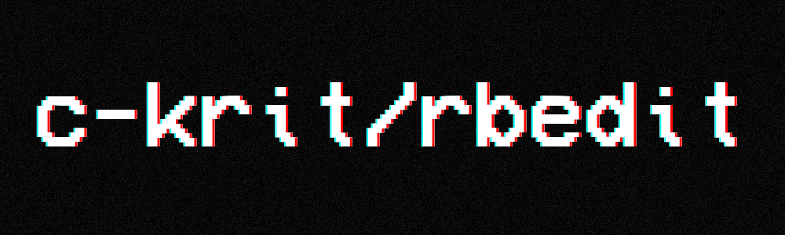

 

A lightweight physics simulation environment for the [ferox physics library](https://github.com/c-krit/ferox).

**WARNING: This software is in an early alpha stage, use it at your own risk.**

## Features

- Canvas with custom width and height, as well as camera zoom
- Press the left `Ctrl` key while scrolling with your mouse to quickly zoom in and out
- Drag dynamic rigid bodies with your mouse, or use arrow keys to change their positions
- Play, pause, restart, or single-step the physics simulation whenever you want
- Add, remove, or change the properties of the rigid bodies on the panel

## License

MIT License
